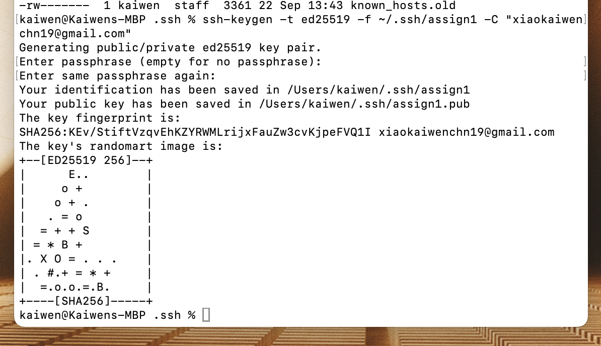
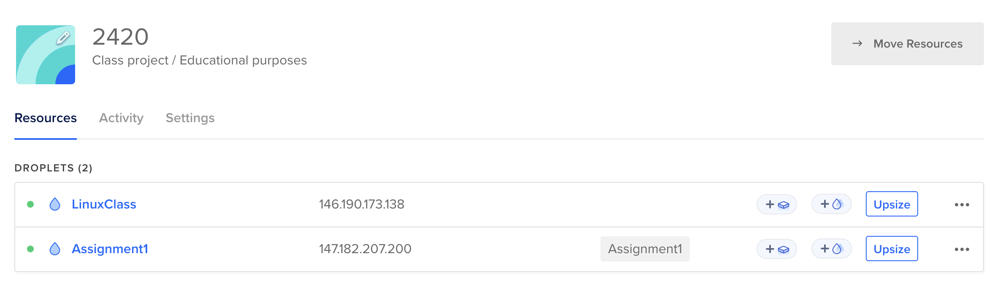
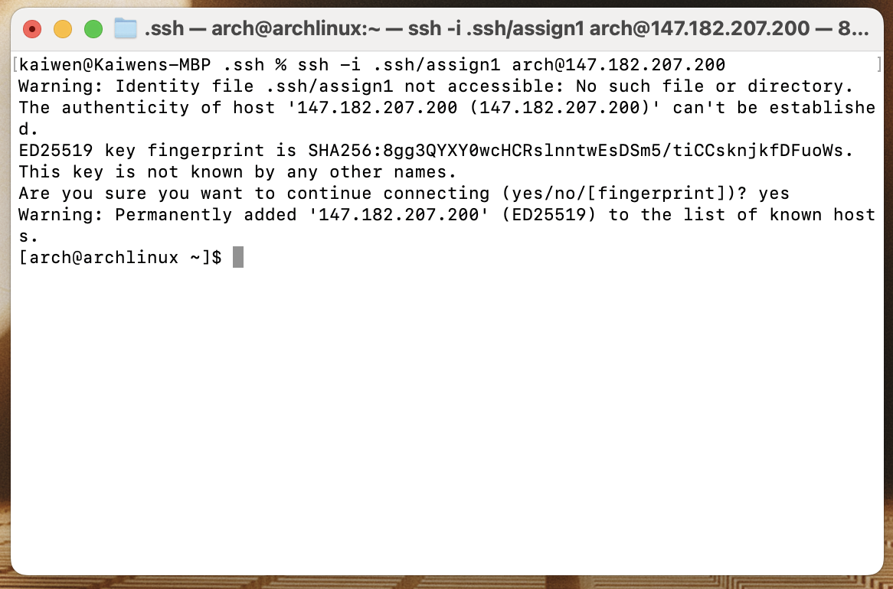
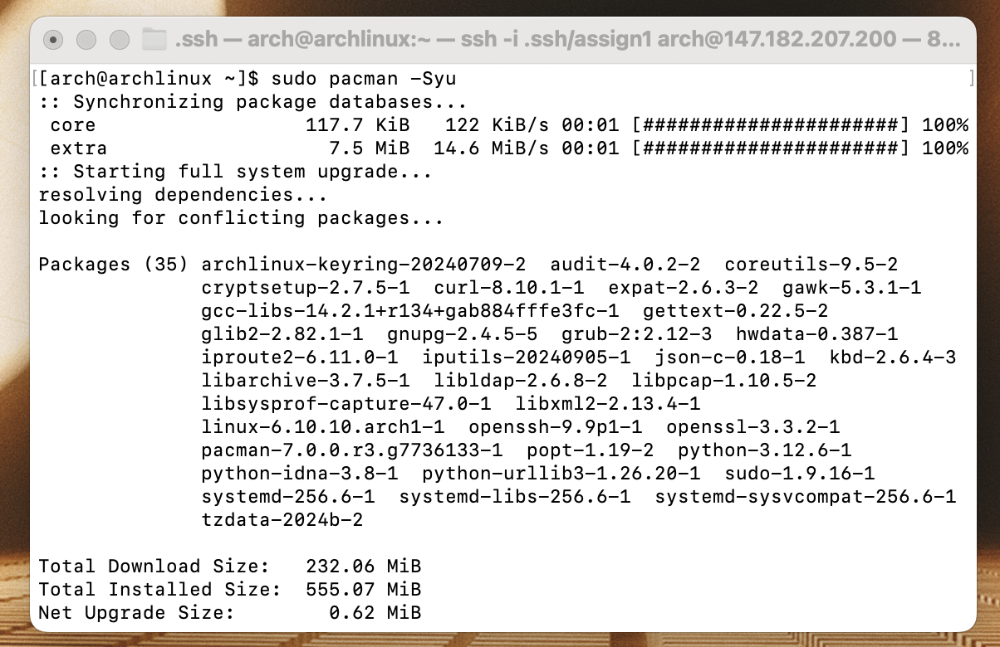
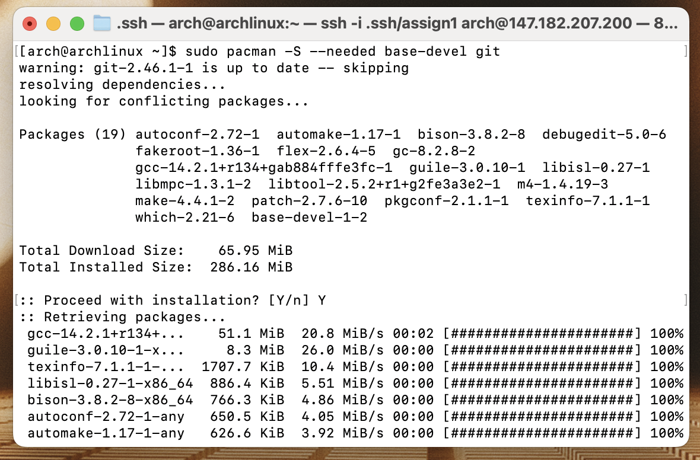
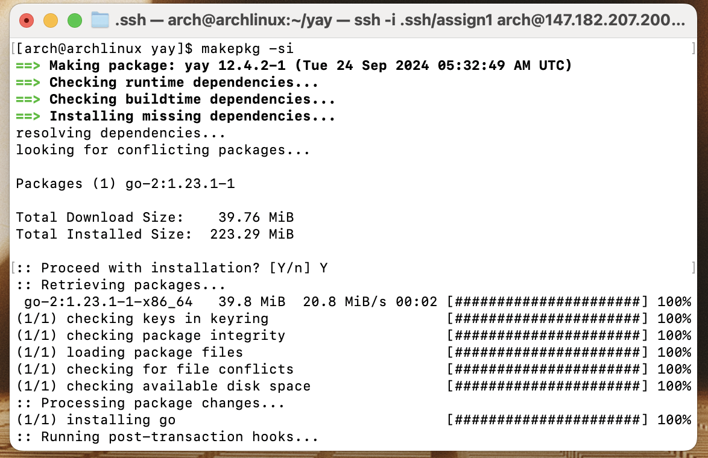
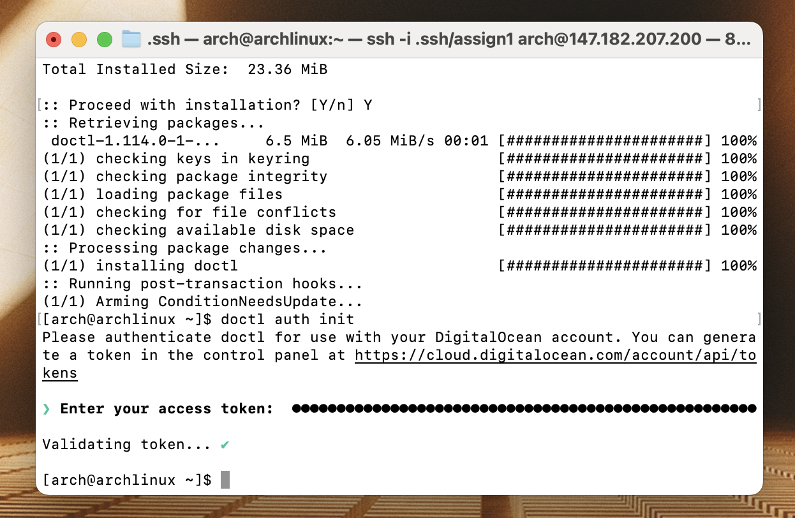
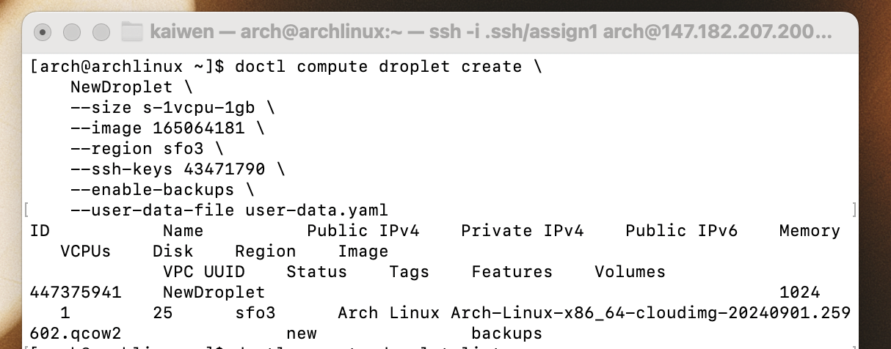
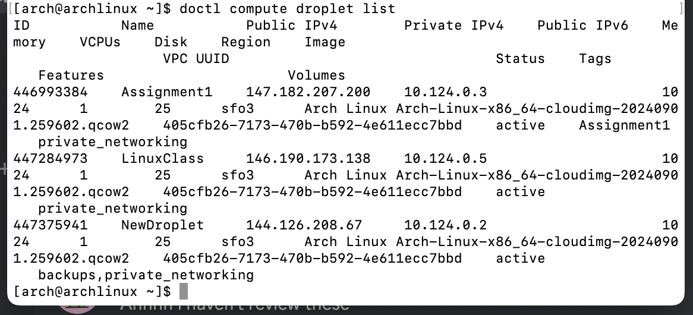

# ACIT 2420 Assignment 1 Level 3 Guide

## Guide Objectives

- Create an **SSH key pair** on your local machine
- Deploy an Arch Linux droplet on DigitalOcean
- Connect to the Arch droplet using SSH securely
- Install and configure `doctl` on the Arch droplet using **Pacman**
- Automate the creation of a new droplet with `cloud-init` and `doctl`
- Verify and manage your DigitalOcean droplets using `doctl`

---

Before starting, make sure you have

- Registered a [DigitalOcean](https://www.digitalocean.com/) account.
- `ssh-keygen` installed on your local machine.

## Step 1: Create SSH key pair on your local machine

To create an SSH key pair, open your terminal and run the command below:

```
ssh-keygen -t ed25519 -f ~/.ssh/assign1 -C "your email address"
```

The output will be:


> Explanation of this command:

- `ssh-keygen`: Generate an SSH key pair.
- `-t ed25519`: Use the Ed25519 algorithm.
- `-f ~/.ssh/assign1`: Save the key pair as `assign1` in `~/.ssh/`.
- `-C "your email address"`: Add a comment (usually your email or identifier), replace this placeholder with your own email.

The command above creates a key pair in your `.ssh` directory:

- Private key: `assign1`.
- Public key: `assign1.pub`.

> The reason why we created this SSH key pair:
>
> - Secure Access: Allowing safe connection to the droplet.
> - Automation: Allowing `doctl` and `cloud-init` to automate tasks without passwords.
> - DigitalOcean Requirements: SSH keys are recommended for secure droplet creation.

## Step 2: Add SSH key pair to your DigitalOcean account

In your DigitalOcean account, go to **Control Panel**.  
In Control Panel, click **Settings** at the bottom of the left sidebar.  
In Settings, click **Security**. Then click **Add SSH Key**.

To gain Public Key, run this command in terminal:

```
pbcopy < ~/.ssh/assign1.pub
```

> Explanation of this command:

- `pbcopy`: Copy text to clipboard.
- `< ~/.ssh/assign1.pub`: Redirect the contents of assign1.pub into `pbcopy`.

Then paste to DigitalOcean from clipboard to add SSH key pair.

## Step 3: Create an Arch droplet using the SSH key pair

Under **Control Panel**, click the green button **Create** at the top, then select **Droplets** in dropdown menu.

In this page, the configuration details are listed below:

> 1. Choose Region: `San Francisco`
> 2. Datacenter: `SFO3`
> 3. Choose an image -> Custome Image: `Arch-Linux-x86_64-cloudimg-20240901.259602.qcow2`
> 4. Choose Size -> SHARED CPU: `Basic` -> CPU Options: `Premium AMD` -> `$7/mo`
> 5. Choose Authentication Method -> SSH Key: choose the key `Assign1` which we just created
> 6. Click **Create Droplet** at the bottom right

## Step 4: Connect to existing Arch droplet via SSH

From step 3 we have created an Arch Linux droplet, named **Assignment1**(SFO3/1GB/25GB Disk) with IP address `147.182.207.200`.



To connect to **Assignment1** via the SSH key we just added to DigitalOcean, run the following command:

```
ssh -i .ssh/assign1 arch@147.182.207.200
```

> Explanation of this command:

- `ssh`: Initiate an SSH connection.
- `i .ssh/assign1`: Use the private key (assign1) for authentication.
- `arch@147.182.207.200`: Specify the username (arch) and the server's IP address `147.182.207.200`.

The output will be:


After running the command above, we have successfully connected to the Arch Linux droplet in DigitalOcean via SSH key pair.

## Step 5: Install and configure `doctl` under existing droplet environment using Pacman

Firstly, make sure you are connected to the arch linux droplet via this command:

```
ssh -i .ssh/assign1 arch@147.182.207.200
```

To install `doctl`, we have to make sure the system is fully updated including the pacakage database. By running the command below, we have the latest `doctl` version available without compatibility issues:

```
sudo pacman -Syu
```

> Explanation of this command:

- S: Sync the package databases.
- y: Refresh the package databases.
- u: Update all out-of-date packages installed on the system.

The output will be:


Now we have `pacman` available for Arch Linux package management, we are going to use **Arch User Repository (AUR)** to install `doctl`.

We will run this command below to include necessary tools to build packages from the AUR:

```
sudo pacman -S --needed base-devel git
```

> Explanation of this command:

- `sudo`: Run the command with root privileges.
- `pacman`: Install the specified packages.
- `--needed`: Skip reinstallation of already installed packages.
- `base-devel`: A group of essential development tools.
- `git`: Version control tool for cloning and managing code.

The output will be:


AUR contains many packages that are not in official repositories, therefore we need an AUR helper to manage these packages conveniently. Here, we'll use one of the most popular AUR helpers, `yay` via git clone:

```
git clone https://aur.archlinux.org/yay.git
```

Then we navigate in to `yay` directory and install it:

```
cd yay
makepkg -si
```

> Explanation of this command:

- `makepkg`: Build a package from a PKGBUILD script.
- `-s`: Install missing dependencies.
- `-i`: Install the built package.

The output will be:


(Optional) After installation, you can remove the `yay` directory:

```
cd ..
rm -rf yay
```

> Explanation of this command:

- `rm`: Remove files or directories.
- `-r`: Recursively delete the directory and all its contents.
- `-f`: Force the deletion, ignoring errors or prompts.

Once `doctl` is installed, you’ll need to authenticate it with your DigitalOcean account. Generate a personal access `token` on [DigitalOcean](https://docs.digitalocean.com/reference/api/create-personal-access-token/) here.

Next step, we can log into doctl via this command:

```
doctl auth init
```

> Enter the `token` when prompted.
> The validation prompt will be:
> 

## Step 6: Configure `cloud-init` using yaml file for droplet creation

Firstly, make sure you are connected to the arch linux droplet via this command:

```
ssh -i .ssh/assign1 arch@147.182.207.200
```

To create and open the file using Neovim, run the command below:

```
nvim user-data.yaml
```

> Explanation of this command:

- `nvim`: Launch text editor Neovim.
- `user-data.yaml`: The name of the file you want to open and create.

Once you enter Neovim, press `i` on you keyboard to enter insert mode.

Copy and paste the following YAML configuration into Neovim:

```
users:
  - name: newuser
    gecos: New User
    sudo: ['ALL=(ALL) NOPASSWD:ALL']
    groups: sudo
    ssh-authorized-keys:
      - ssh-rsa YOUR_SSH_PUBLIC_KEY_HERE

packages:
  - package1
  - package2

disable_root: true
```

> Explanation of this command:

- `name: newuser `: Replace 'newuser' with preferred username.
- `gecos: New User `: Replace 'New User' with full name of the user.
- `sudo: ['ALL=(ALL) NOPASSWD:ALL']`: Allow user to run with root priviledges without password.
- `groups: sudo `: Add user to the sudo group.
- `ssh-authorized-keys:
  - ssh-rsa YOUR_SSH_PUBLIC_KEY_HERE`: Replace with your actual public SSH key.
- `packages: - package1 `: Replace with the packages you want to install.
- `disable_root: true`: Disable root login via SSH.

After replacement, we will run the command below:

```
users:
  - name: kaiwen
    gecos: Kaiwen Xiao
    sudo: ['ALL=(ALL) NOPASSWD:ALL']
    groups: sudo
    ssh-authorized-keys:
      - ssh-rsa AAAAB3NzaC1yc2EAAAADAQABAAACAQ...

packages:
  - nvim
  - git

disable_root: true
```

Then we press `ESC`, type `:wq`, and hit `Enter` to save the changes.

## Step 7: Create a new Arch Linux droplet via `doctl` with `cloud-init` user-data configuration

To create a new droplet via `doctl`, run the following command:

```
doctl compute droplet create \
    <name of your new droplet> \
    --size <size of CPU and RAM> \
    --image <image ID> \
    --region <region and datacenter> \
    --ssh-keys <ssh key ID> \
    --enable-backups \
    --user-data-file user-data.yaml
```

> Explanation of this command:

- `doctl compute droplet create \`: Create a new droplet on using `doctl`
- `    <name of your new droplet> \`: The name of your droplet. We are replacing it with `NewDroplet` here.
- `    --size <size of CPU and RAM> \`: The size of the droplet. We are using `s-1vcpu-1gb`, which means 1 virtual CPU and 1 GB of RAM.
- `    --image <image ID> \`: The image ID of the OS that will be installed on the droplet. We are using `165064181`, which is the ID of the Arch Linux image uploaded to DigitalOcean earlier.
- `    --region <region and datacenter> \`: Region for the droplet, we are using `sfo3` which is the closest to Vancouver.
- `    --ssh-keys <ssh key ID> \`: The ID of the SSH key for secure access.
- `    --enable-backups`: Enable automatic backups for the droplet.
- `    --user-data-file user-data.yaml`: Specify the cloud-init configuration file to execute during droplet creation.

Therefore the command we are going to run is:

```
doctl compute droplet create \
    NewDroplet \
    --size s-1vcpu-1gb \
    --image 165064181 \
    --region sfo3 \
    --ssh-keys 43471790 \
    --enable-backups \
    --user-data-file user-data.yaml
```

The output will be:


To validate if we have sucessfullt created a droplet or not, run the command below to display a list of all active droplets in your DigitalOcean account:

```
doctl compute droplet list
```

The output will be:

